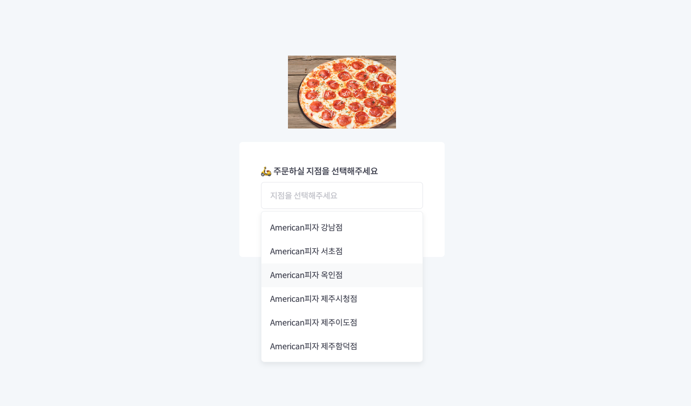

# Creating form Side Project

프로젝트 설명

1. 토글 버튼에 click, blur로 2가지 addEventlistener를 적용하여 토글 버튼을 클릭했을때 유저가 메뉴 종류를 확인할 수 있고, 토글 버튼 외 다른 영역을 클릭했을때 토글 버튼 focus가 해제되는 순간 blur event가 발생하게 되어 확인할 수 있는 메뉴 종류가 모두 사라집니다.

2. dropmenu에 click으로 addEventlistener를 적용하여 click된 button의 textContent를 토글 버튼 textContent로 저장하고, 토글 버튼 CSS스타일 추가와 더불어 nextBtn의 disabled를 제거하여 form submit이 가능하게 합니다.

# 프로젝트 실행 화면

